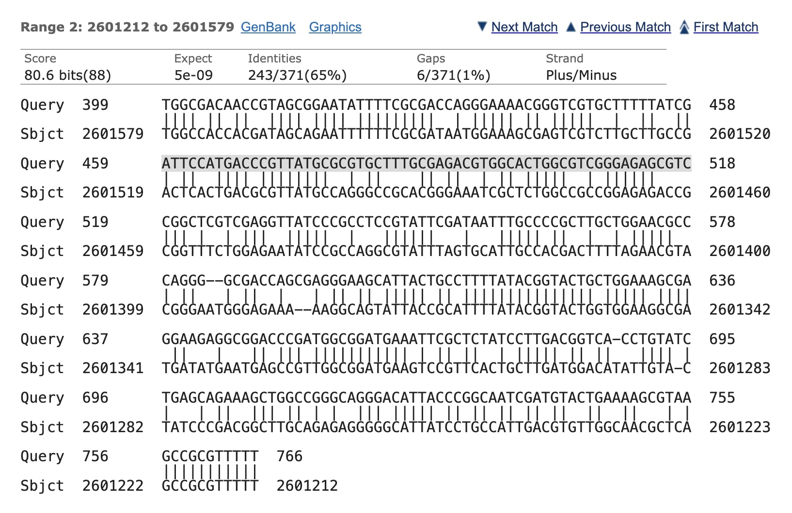

## Overview

This assignment is about solving problems using recursion.  The assignment will be a mixture of divide and conquer and dynamic programming.

## Part 1: Creating a matrix class

Create a class called Kotlin class capable of storing square matrices.  I won't be overly prescriptive about how you write your class, but you should support basic operations like creating a matrix of size $n$, setting / getting values at specified row and column indices.  Don't worry about matrix multiplication yet, that's coming!

## Part 2: Strassen's Algorithm for Matrix Multiplication

Add the functions ``multiply`` and ``strassenMultiply`` to your matrix class. These functions should do the following (note: here I'm using ``Matrix`` as a stand-in for whatever you call your class from part 1 of the assignment)

```kotlin
class Matrix {
    // ... (other stuff omitted)
    
    /**
     * Multiply [this] matrix by [other].
     * You can implement this either using block-based matrix multiplication or
     * traditional matrix multiplication (the kind you learn about in math
     * classes!)
     * @return [this]*[other] if the dimensions are compatible and null otherwise
     */
    fun multiply(other: Matrix):Matrix? {
        // your implementation here
    }


    /**
     * Multiply [this] matrix by [other].
     * Your code should use Strassen's algorithm
     * @return [this]*[other] if the dimensions are compatible and null otherwise
     */
    fun strassenMultiply(other: Matrix):Matrix? {
        // your implementation here
    }
}
```

Write some unit tests to show your code is correct.  At what size matrix does Strassen's algorithm become faster than the traditional method?

## Part 3: Dynamic Programming for Aligning Protein Sequences

Watch the following video [on the sequence alignment problem](https://www.youtube.com/watch?v=dYuktSSPfYQ).  Hopefully, it will give some good motivation behind what the problem is and why it's important.

Implement either the [Needleman-Wunsch Algorithm](https://en.wikipedia.org/wiki/Needleman%E2%80%93Wunsch_algorithm) or the [Smith-Waterman Algorithm](https://en.wikipedia.org/wiki/Smith%E2%80%93Waterman_algorithm) for sequence alignment.

You may find [this resource](https://rna.informatik.uni-freiburg.de/Teaching/index.jsp?toolName=Needleman-Wunsch) useful for testing your code and understanding the algorithms.

Your code should find both the best alignment and use backtracing to display the alignment itself.

> Note: I'm going to be looking for some sample data (real protein sequences) to use with this.  Stay tuned (or if you find some, please let me know).


Here is an alignment between part of a Salmonella genome and another part of the same genome (see course announcement for details)



## Turning in your work

Submit a link to a repository that has your code and writeup.  Make sure to add ``berwinlan``, ``aditivinod``, and ``paulruvolo`` as collaborators if the repo is private.

## Assessment

See the rubric on Canvas.
