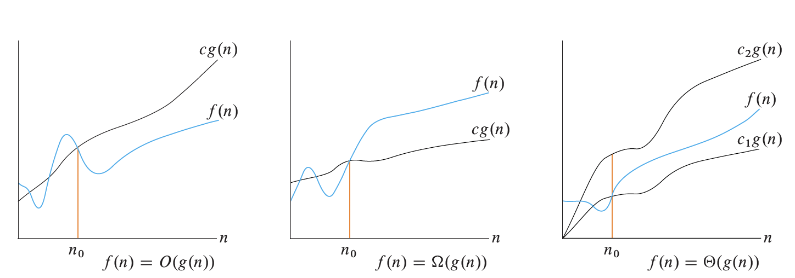

## Announcements and Reminders

* If you haven't yet, please fill out the office hours when2meets (see Canvas).
* Consider joining the Slack.

## Algorithm Design Patterns Whirlwind Tour

We're going to take a few classes to get a feel for the various algorithmic design patterns we will meet this semester.  During class 1, we met the design pattern *divide and conquer*.  Today, we'll be learning about greedy algorithms.

Wikipedia has a concise definition of a greedy algorithm.

> A greedy algorithm is any algorithm that follows the problem-solving heuristic of making the locally optimal choice at each stage.

The question becomes, does the greedy strategy lead to an optimal solution to the problem?  In some cases it may lead to such a solution, and in other cases it may not.

> **Sample Problem** Seeing where a greedy approach fails
> 
> To make sure we understand which problems can be solved with a greedy algorithm, it may be more intuitive to think about some cases that a greedy algorithm cannot solve. Let's work through an example of this to all get on the same page.
> 
> *Knapsack Problem*: Given $N$ items where the $i$th item weights $w_i$ pounds, determine an assignment of items to two knapsacks such that the combined weight of the items in each knapsack is the same.
> 
> **Example:** There are five items with weights $6, 5, 9, 1, 1$.
> 
> **Solution:** Knapsack 1: $\{5, 6\}$, Knapsack 2: $\{1, 1, 9}$.
>
> 
> What's the greedy approach?  Let's start with the knapsacks empty and choose the combination of knapsack and item that causes the total weight in each knapsack to stay as close as possible.  Let's track how the knapsacks $K_1$, $K_2$, and the remaining items, $R$, would evolve over time if we applied this procedure.
> 1. $K_1 = \[ 1 \], K_2 = \[ \], R = \[6, 5, 9, 1\]$
> 2. $K_1 = \[ 1 \], K_2 = \[ 1 \], R = \[6, 5, 9 \]$
> 3. $K_1 = \[ 1, 5 \], K_2 = \[ 1 \], R = \[ 6, 9 \]$
> 4. $K_1 = \[ 1, 5 \], K_2 = \[ 1, 6 \], R = \[ 9 \]$
> 5. $K_1 = \[ 1, 5, 9 \], K_2 = \[ 1, 6 \]$
> 
> This approach has clearly failed since the weights in $K_1$ total 15 and the weights in $K_2$ total 7.
{: .notice--info}

Now, let's work through the following exercise as a group.

> **Exercise 1**
> 1. Suppose you have a budget of $N$ dollars to purchase flour and that flour can be purchased on day $i$ for $x_i$ dollars per pound.  Determine the maximum amount of flour you can purchase with your budget.  Is your algorithm a greedy algorithm? (you can assume that buying a fraction of a pound is allowed).  How would you modify your algorithm if you were limited to purchasing $M$ pounds of flour each day?  Is the new algorithm greedy?
> 2. Determine a greedy algorithm for making change for $N$ cents using quarters, dimes, nickels, and pennies.  Does your greedy algorithm use the fewest coins possible (make an intuitive argument, no proof necessary)? 
> 3. If the US began minting a 20-cent coin, would a greedy algorithm still solve the optimal change-making problem? (Wikipedia has some useful information on [the change-making problem](https://en.wikipedia.org/wiki/Change-making_problem) if you want to learn more)
{: .notice--success}

### Optimal Roadtripping

> **Exercise 2** You are planning a road trip of $N$ miles.  Your electric car has a range of $M$ miles.  There are charging stations located at mile $a_1, a_2, a_3, \ldots, a_k$ (as measured from the start of the route).  Determine a procedure to figure out the minimum number of recharges you have to make in order to complete the road trip.
> 
> <button onclick="HideShowElement('HideShow1')">Show / Hide Hint 1</button>
> 
Start by thinking about the first decision you have to make (where to make your first recharging stop).  Is there a best first place to stop?

> <button onclick="HideShowElement('HideShow2')">Show / Hide Hint 2</button>
> 
Assuming that you recharge completely each time you choose to stop, does it ever make sense to stop at an earlier charging station than you could have reached?

{: .notice--success}

## O() and Friends

Next, we are going to return to what we did in the first class where we calculated the runtime of an algorithm as a function of the input size $n$.  Let's say we compute the runtime of an algorithm 1 to be $2 n^2 + 5n + 200$ and the runtime of algorithm 2 to be $3 n^2 + 2 n$.  Is one necessarily faster than the other?  We can graph the two runtimes and see.

Something interesting happens around $n=16$ (the lines cross).  However, if we let the input size get really large and plot the ratios of the two runtimes, we can see that algorithm 2 takes 50% longer to run than algorithm 1.

The idea behind order of growth, is to find a way to draw meaningful distinctions between how fast functions increase.  Where meaningful in this case is based on how the functions behave when the input, $n$, gets very large and where we ignore constant factor differences in the functions (e.g., if a function is twice another, it is pretty much the same for our purposes).

We say that $f(x) = O(g(x))$ if there exists a positive real number $M$ and a real number $x_0$ such that, $\|f(x)\| \leq M g(x)~\text{for all}~x\geq x_0$.

$f(x) = \Omega(g(x))$ if there exists a positive real number $M$ and a real number $x_0$ such that, $\|f(x)\|\geq M g(x)~\text{for all}~x \geq x_0$

We say that $f(x) = \Theta(g(x))$ if $f(x) = O(g(x))$ and $f(x) = \Omega(g(x))$.

Here is a handy figure from "Introduction to Algorithms" by Cormen, Leiserson, Rivest, and Stein.

With your group, explain how the formal definitions (given earlier) relate to these pictures.

> **Exercise 3**
> 1. Show that $10000 n = O(n^2)$ (let's do this one together).
> 2. Show that $n^2 \neq O(n)$.
>    <button onclick="HideShowElement('HideShow3')">Show / Hide Hint</button>
>    
Write out the condition for $O()$ and show that it cannot be satisfied.

> 3. Show that $\frac{3^n}{10000} = \Omega(2^n)$
>    <button onclick="HideShowElement('HideShow4')">Show / Hide Hint</button>
>    
Follow the blueprint by writing out the condition for $\Omega$.  You don't have to necessarily find $x_0$, but convince yourself that one exists.

> 4. Argue (up to you how formal to make your argument) that any polynomial is $O(2^n)$
{: .notice--success}

> **Exercise 4** This problem is from former Olin Professor Allen Downey's Think Python second edition.   In this context, order of growth can be understood to mean $\Theta$.  I made one modification to part 3 of the exercise.
> * What is the order of growth of $n^3 + n^2$? What about $1000000 n^3 + n^2$? What about $n^3 + 1000000 n^2$?
> * What is the order of growth of $(n^2 + n)(n + 1)$?
> * If $f$ is in $O(g)$ and $g$ is a continuously increasing functions that grows infinitely large as $n \rightarrow \infty$, what can we say about $af+b$, where $a$ and $b$ are constants?
> * If $f_1$ and $f_2$ are in $O(g)$, what can we say about $f_1 + f_2$?
> * If $f_1$ is in $O(g)$ and $f_2$ is in $O(h)$, what can we say about $f_1 + f_2$?
> * If $f_1$ is in $O(g)$ and $f_2$ is $O(h)$, what can we say about $f_1 \times f_2$?
{: .notice--success}

## Peak finding in Kotlin

Let's create an implementation of the peak-finding algorithm we determined in class last time.  If you are not here for the live demonstration (or if we somehow run out of time), you can find the solution in [the class sample solutions repo under Class01](https://github.com/OlinDSA2025/SampleSolutions).