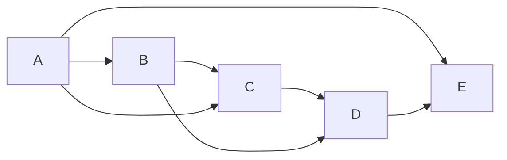
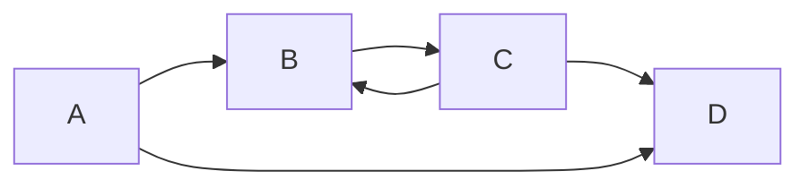
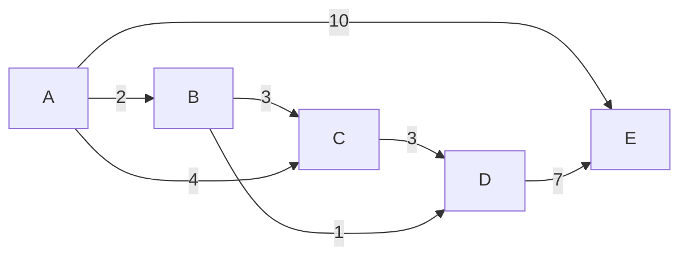

## Directed-Acyclic Graphs

Starting off, let's revisit a problem that most of you didn't get to from last class.  This is the problem of determining of a given directed graph is acyclic. To motivate this, let's consider the following graph.



Perhaps unsurprisingly, a directed graph is a directed acyclic graph ([DAG](https://en.wikipedia.org/wiki/Directed_acyclic_graph)) if it contains no cycles.  Cycles are paths through the graph that repeat vertices.

One of the supplementary problems in the last class is an algorithm known as Kahn's algorithm for determining if a graph is a DAG.  More specifically, it computes a topological sorting of the vertices of the graph, and if a sorting exists, the graph has no cycles.  A topological sorting of a graph is an ordering of the graph's vertices $v_1, v_2, \ldots, v_n$ such that the edge $v_i \rightarrow v_j$ can only exist if $i < j$.

Here is pseudocode for the algorithm Kahn's algorithm.

```
L ← Empty list that will contain the sorted elements
S ← Set of all nodes with no incoming edge

while S is not empty do
    remove a node n from S
    add n to L
    for each node m with an edge e from n to m do
        remove edge e from the graph
        if m has no other incoming edges then
            insert m into S

if graph has edges then
    return error   (graph has at least one cycle)
else 
    return L   (a topologically sorted order)
```

Let's go through this example together to see how Kahn's algorithm works.

Let's try Kahn's algorithm on a graph that does contain a cycle to see what happens.



## Dijkstra's Algorithm

I have some companion slides to go along with the presentation of Dijkstra's algorithm.  I'll have these up on the projector, but you can [access the slides](graphsearch_slides.pdf) using this link.

Before we introduce Dijkstra's algorithm, we need to briefly introduce the idea of weighted graphs.  Imagine that in addition to storing the neighbors of each vertex in our graph, we also store an edge weight.  Here is what a graph might look like with edge weights added.




As an aside, edge weights could encode a bunch of different things in our graph.  In computer vision, edge weights can encode the similarity between neighboring parts of an image and this graph can then be processed to segment parts of an image.  Another classical example is graph traversal where we might want to find the shortest path through a graph connecting $v_{start}$ to $v_{goal}$. In this setting, the cost of a path is defined by the sum of edge weights along the path. 

## Min-Heaps

A [binary heap](https://en.wikipedia.org/wiki/Binary_heap) is a data structure that is very useful for implementing the priority queue will need for Dijkstra.  Before getting started with learning about what a Heap is, let's talk about the running time of various operations on a heap.