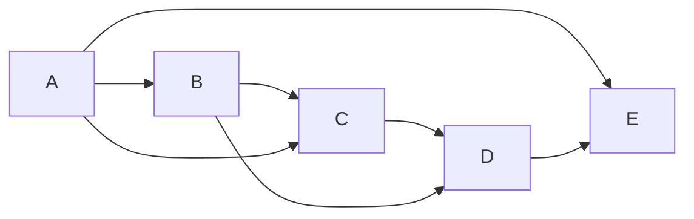

## Directed-Acyclic Graphs

Starting off, let's revisit a problem that most of you didn't get to from last class.  This is the problem of determining of a given directed graph is acyclic. To motivate this, let's consider the following graph.

