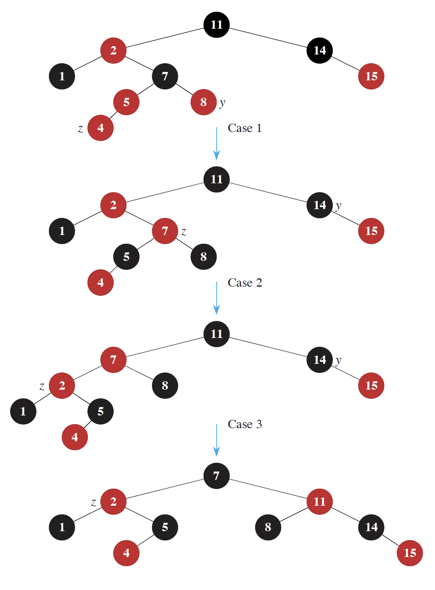

## Overview

Today, we will learn about the binary search tree (BST).  We will find that BSTs are incredibly useful for searching for items within a collection.  Further, if we want to do things like find the closest element in our collection to a specific query, BSTs will give us great performance.

## Review of Our Data Structures

Let's do a quick review of the data structures we've seen so far and recall their time complexities.

We'll fill them out together, and I'll update the website after with the finished table.

> **Exercise 1**
> 
> Create a table with the $\Theta$ runtime for each data structure (Array, Linked List, Hash Table, Heap) at performing the operations insert, delete a specific element, lookup (exact), and lookup (closest).  Some data structures do not naturally support some operations, so you can either mark those as N/A or use $\Theta(n)$.  The operation Lookup (closest) means to find the closest element to a query within the collection.
> 
> **Note:** some of my answers (below) are open to interpretation (e.g., depending on how you implement a particular data structure, some answers may differ).
{: .notice--success}

<button onclick="HideShowElement(&quot;HideShow1&quot;)">Show / Hide Solution to Exercise 1</button>

  <table>
    <thead>
      <tr>
        <th>Data Structure</th>
        <th>Insert</th>
        <th>Delete</th>
        <th>Lookup (exact)</th>
        <th>Lookup (closest)</th>
      </tr>
    </thead>
    <tbody>
      <tr>
        <td><strong>Array</strong></td>
        <td>$\Theta(1)$</td>
        <td>$\Theta(n)$</td>
        <td>$\Theta(n)$</td>
        <td>$\Theta(n)$</td>
      </tr>
      <tr>
        <td><strong>Linked List</strong></td>
        <td>$\Theta(1)$</td>
        <td>$\Theta(n)$</td>
        <td>$\Theta(n)$</td>
        <td>$\Theta(n)$</td>
      </tr>
      <tr>
        <td><strong>Heap</strong></td>
        <td>$\Theta(\log n)$</td>
        <td>$\Theta(\log n)$</td>
        <td>N/A (typically not supported)</td>
        <td>N/A (typically not supported)</td>
      </tr>
      <tr>
        <td><strong>Hash Table</strong></td>
        <td>$\Theta(1)$</td>
        <td>$\Theta(1)$</td>
        <td>$\Theta(1)$</td>
        <td>$\Theta(n)$</td>
      </tr>
    </tbody>
  </table>

## Linear and Binary Search

We've seen these concepts in some form already this semester, but let's make sure we have them at the forefront of our minds.

Suppose we have a collection integers stored in an array $x_1, x_2, \ldots, x_n$.  Further, let's suppose the array is sorted in ascending order (i.e., $x_i < x_j$ if and only if $i < j$).  Now suppose given a query point $x_q$ we'd like to find the element in our array that satisfies the following equation.

$\begin{aligned} x^\star &= \underset{i}{\text{argmin}} \| x[i] - x_q \| \end{aligned}$

This equation is just a fancy way of saying that we look for the closet (in this case as defined by the absolute value) between the query and the elements in the collection.

Here are two ways to find the closest element in the array.

### Linear Search

This one is simple.  We loop through the collection constantly comparing each element to the query.  We remember the closest match we've seen so far, and we update it if we find a closer match.  As you can probably see, this operation would have a cost of $\Theta(n)$.

### Binary Search

Binary search works by eliminating half of the elements as candidates for our search at reach step.  If we are looking for an exact match to our query, we can repeatedly divide our input list into three parts, consisting the left elements, the middle element, and the right elements.  By comparing the middle element to the query, we can determine which of the left or right elements to search for to find our query (see the Wikipedia page on [Binary Search algorithm](https://en.wikipedia.org/wiki/Binary_search_algorithm) for pseudocode on how to implement this).  Using the tools we saw in the divide and conquer portion of this class (e.g., the master theorem), we can show that this procedure has a $\Theta(\log n)$ running time.

> **Exercise 2**
> 
> We have not yet addressed the problem of looking for the closest element in the array (we have only shown how to find the element exactly). How could we modify our search procedure to find the closest element to $x_q$?  You don't have to write out full pseudocode.  Can you describe the technique at a high-level?  There is more than one way to address this problem, so if your approach doesn't match the hint, that's okay!
>
> <button onclick="HideShowElement(&quot;HideShow2&quot;)">Show / Hide Hint 1</button>
> 

> You may find the concept of predecessor and successor to be useful here.  The successor of $x_q$ is the closest element in the collection that is larger than $x_q$.  The predecessor is the closest element in the collection that is smaller than $x_q$.
> 

> <button onclick="HideShowElement(&quot;HideShow3&quot;)">Show / Hide Hint 2</button>
> 

> Either the predecessor or the successor is guaranteed to be the closest to the query. 
> 

{: .notice--success}

> **Exercise 3**
> 
> Suppose we now want to support the ability to add new elements to our collection while still maintaining our sorted list (and getting the great $\Theta(\log n)$ runtime).  What is the time complexity of adding (or deleting) elements from our array while maintaining the sorted order?
{: .notice--success}

## Meet the Binary Search Tree

BSTs are data structures that allow us to maintain $\Theta(\log n)$ search (either exact or approximate) while providing $\Theta(\log n)$ insertion and removal.  The basic idea is to change the storage of our sorted data from an array to a tree.

Original sorted data: $1, 2, 5, 8, 20, 100, 202$.

As a BST:

graph TB
  8 --> 2
  8 --> 100
  2 --> 1
  2 --> 5
  100 --> 20
  100 --> 202

This tree maintains the invariant that for a given node, each of the nodes in the left subtree is less than that node.  Similarly, the nodes in the right subtree are each greater than this node.  Note that if the array has duplicate values, you can arbitrarily place the duplicate in either the left or right subtree.

The benefit of the binary search tree is that we can easily add elements to the tree while maintaining the BST invariant (that smaller nodes are always in the left subtree and that larger nodes are always in the right subtree).

> **Exercise 4**
> 
> After inserting  6, 7, and 21 (in that order), what would our BST look like?  In constructing your answer, you do not need to move any of the existing nodes.  Rather, you can attach new nodes to the leaves of the trees.
{: .notice--success}

### Maintaining Balance

The issue we'll run into with the scheme we used in problem 4, is that if we get unlucky, we'll end up with a highly unbalanced tree.  A tree is unbalanced if there are significantly different numbers of nodes in the left and right subtrees of its nodes.  Formally, we say that for any node in the tree, its left and right subtrees have heights that differ by at most 1.  Notice how this definition rules out certain pathological trees like a long chain of sorted numbers where the left subtree is always empty.

There are several commonly used schemes to maintain balance in BSTs.  The two most common methods are [AVL trees](https://en.wikipedia.org/wiki/AVL_tree) and [Red-Black Trees](https://en.wikipedia.org/wiki/Red%E2%80%93black_tree).

## Red-Black Trees

Red-Black trees have the following properties.

1. Each node in the tree is colored either red or black.
2. The root is black and any leaves (corresponding to null values) are black.
3. If a node is red, then both its children are black.
4. The number of black nodes encountered on any path from the root to a leaf (null) is equal.

I really like Michael Sambol's video series explaining the Red-Black tree.  We'll watch some of the videos together, but I'll leave it to you to watch the whole set.

[Playlist of Michael Sambol's Red-Black tree videos](https://www.youtube.com/playlist?list=PL9xmBV_5YoZNqDI8qfOZgzbqahCUmUEin)

Together, we'll watch the first four videos (with an exercise as an intermediary).

* [Main Idea and Structure](https://www.youtube.com/watch?v=qvZGUFHWChY)

> **Exercise 5:**
> 
> **We'll try to solve this as a class**
> 
> Suppose you are given a valid red-black tree of with $n$ nodes, show that searching for an element in this tree takes time $\Theta(\log n)$.
> 
> <button onclick="HideShowElement(&quot;HideShow4&quot;)">Show / Hide Hint</button>
> 

> You may find it easier to show that Red-black trees have heights less than $2 \log_2(n+1)$.  From this fact you should be able to establish the running time you are after. 
> 

{: .notice--success}

* [Rotations](https://www.youtube.com/watch?v=95s3ndZRGbk)
* [Insertions (strategy)](https://www.youtube.com/watch?v=5IBxA-bZZH8) (note: there is an error at 3:27 where you would have to apply case 3 to fix the node "A". This is discussed in the comments of the video).

Here are some additional resources to help you think through the information covered in these videos.

First, here is an animation that shows the rotation procedure on a red-black tree.

.gif)
Source: [Wikimedia Commons](https://commons.wikimedia.org/wiki/File:Binary_Tree_Rotation_(animated).gif)

When inserting nodes into an RB-tree we follow the following process:

1. Insert the node into the appropriate location in the tree (based on the BST property) and color it red. Question for the class: which of the four properties above could be violated after this step?
2. Match the current state of the tree to the one of four cases (labeled case 0, case 1, case 2, or case 3).  Perform a remedial action (recoloring and/or rotation) based on the specific case.  See below for cases.
3. Check to see if there are additional violations higher up the tree.

Here are the cases when inserting the node $z$:
* Case 0: the node was inserted as the root.
* Case 1: $z$ has a red uncle
* Case 2: $z$ has a black uncle (triangle)
* Case 3: $z$ has a black uncle (line)

> **Exercise 6**
> 
> See below for the result of inserting the node 4 into an RB tree.  Note which transformations to the tree were performed at each step.  After each step, which RB tree properties are still violated?
> 
> 
Source: CLRS textbook
{: .notice--success}

> **Exercise 7**
>
> At each step, argue that the modification to the tree moves the potential violation closer to root while removing the violation farther from the root.  **Consider the application of case 2 and case 3 to be a single step for the purposes of this question**.
{: .notice--success}