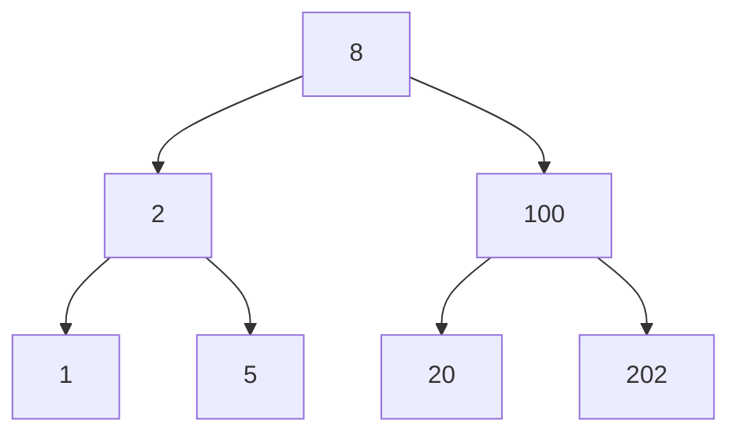

## Overview

Today, we will learn about the binary search tree (BST).  We will find that BSTs are incredibly useful for searching for items within a collection.  Further, if we want to do things like find the closest element in our collection to a specific query, BSTs will give us great performance.

## Review of Our Data Structures

Let's do a quick review of the data structures we've seen so far and recall their time complexities.

We'll fill them out together, and I'll update the website after with the finished table.

**Problem 1** Fill out the $\Theta$ runtime for each data structure at performing each operation.  Some data structures do not naturally support some operations, so you can either mark those as N/A or use $\Theta(n)$.  The operation Lookup (closest) means to find the closest element to a query within the collection.

| *Data Structure* | *Insert* | *Delete* | *Lookup (exact)* | *Lookup (closest)* |
|------------------|----------|----------|------------------|--------------------|
| **Array**        |          |          |                  |                    |
| **Linked List**  |          |          |                  |                    |
| **Heap**         |          |          |                  |                    |
| **Hash Table**   |          |          |                  |                    |

## Linear and Binary Search

We've seen these concepts in some form already this semester, but we'll state them more formally here.

Suppose we have a collection integers stored in an array $x[1], x[2], \ldots, x[n]$.  Further, let's suppose the array is sorted in ascending order (i.e., $x[i] < x[j]$ if and only if $i < j$).  Now suppose given a query point $x_q$ we'd like to find the element in our array that satisfies the following equation.

$\begin{align} x^\star &= \underset{i}{\mbox{argmin}} \| x[i] - x_q \| \end{align}$

This equation is just a fancy way of saying that we look for the closet (in this case as defined by the absolute value) between the query and the elements in the collection.

Here are two ways to find the closest element in the array.

### Linear Search

This one is simple.  We loop through the collection constantly comparing each element to the query.  We remember the closest match we've seen so far, and we update it if we find a closer match.  As you can probably see, this operation would have a cost of $\Theta(n)$.

### Binary Search

Binary search works by eliminating half of the elements as candidates for our search at reach step.  If we are looking for an exact match to our query, we can repeatedly divide our input list into three parts, consisting the left elements, the middle element, and the right elements.  By comparing the middle element to the query, we can determine which of the left or right elements to search for to find our query (see the Wikipedia page on [Binary Search algorithm](https://en.wikipedia.org/wiki/Binary_search_algorithm) for pseudocode on how to implement this).  Using the tools we saw in the divide and conquer portion of this class (e.g., the master theorem), we can show that this procedure has a $O(\log n)$ running time.

**Problem 2** You may have noticed that we are not addressing the problem of looking for the closest element in the array. How could we modify our search procedure to find the closest element to $x_q$?  You don't have to write out full pseudocode.  Can you describe the technique at a high-level?

<button onclick="HideShowElement(&quot;HideShow1&quot;)">Show / Hide Hint 1</button>

You may find the concept of predecessor and successor to be useful here.  The successor of $x_q$ is the closest element in the collection that is larger than $x_q$.  The predecessor is the closest element in the collection that is smaller than $x_q$.

<button onclick="HideShowElement(&quot;HideShow2&quot;)">Show / Hide Hint 2</button>

Either the predecessor or the successor is guaranteed to be the closest to the query. 

**Problem 3** Suppose we now want to support the ability to add new elements to our collection while still maintaining our sorted list (and getting the great $\Theta(\log n)$ runtime).  What is the time complexity of adding (or deleting) elements from our array while maintaining the sorted order?

## Meet the Binary Search Tree

BSTs are data structures that allow us to maintain $\Theta(n)$ search (either exact or approximate) while providing $\Theta(\log n)$ insertion and removal.  The basic idea is to change the storage of our sorted data from an array to a tree.

Original sorted data: $1, 2, 5, 8, 20, 100, 202$.

As a BST:

This tree maintains the invariant that for a given node, each of the nodes in the left subtree is less than that node.  Similarly, the nodes in the right subtree are each greater than this node.  Note that if the array has duplicate values, you can arbitrarily place the duplicate in either the left or right subtree.

The benefit of the binary search tree is that we can easily add elements to the tree while maintaining the BST invariant (that smaller nodes are always in the left subtree and that larger nodes are always in the right subtree).

**Problem 4** After inserting  6, 7, and 21 (in that order), what would our BST look like?  In constructing your answer, you do not need to move any of the existing nodes.  Rather, you can attach new nodes to the leaves of the trees.

### Maintaining Balance

The issue we'll run into with the scheme we used in problem 4, is that if we get unlucky, we'll end up with a highly unbalanced tree.  A tree is unbalanced if there are significantly different numbers of nodes in the left and right subtrees of its nodes.  Formally, we say that for any node in the tree, its left and right subtrees have heights that differ by at most 1.  Notice how this definition rules out certain pathological trees like a long chain of sorted numbers where the left subtree is always empty.

There are several commonly used schemes to maintain balance in BSTs.  The two most common methods are [AVL trees](https://en.wikipedia.org/wiki/AVL_tree) and [Red-Black Trees](https://en.wikipedia.org/wiki/Red%E2%80%93black_tree).

## Red-Black Trees

Red-Black trees have the following properties.

1. Each node in the tree is colored either red or black.
2. The root is black and each of the (null) leaves are black.
3. If a node is red, then both its children are black.
4. The number of black nodes encountered on any path from the root to a leaf (null) is equal.

In this unit we'll be working with Red-Black trees.  I really like Michael Sambol's video series explaining the Red-Black tree.  We'll watch some of the videos together, but I'll leave it to you to watch the whole set.

[Playlist of Michael Sambol's Red-Black tree videos](https://www.youtube.com/playlist?list=PL9xmBV_5YoZNqDI8qfOZgzbqahCUmUEin)

Together, we'll watch the first four videos.

* [Main Idea and Structure](https://www.youtube.com/watch?v=qvZGUFHWChY)
* [Rotations](https://www.youtube.com/watch?v=95s3ndZRGbk)
* [Insertions (strategy)](https://www.youtube.com/watch?v=5IBxA-bZZH8) (note: there is an error at 3:27 where node ``A`` needs to be recolored).
* [Insertions (example)](https://www.youtube.com/watch?v=A3JZinzkMpk)

If you decide to implement the Red-Black tree for your assignment, these videos should be a great source of information for you.

Note: red-black trees have heights less than $2 \lg(n+1)$.